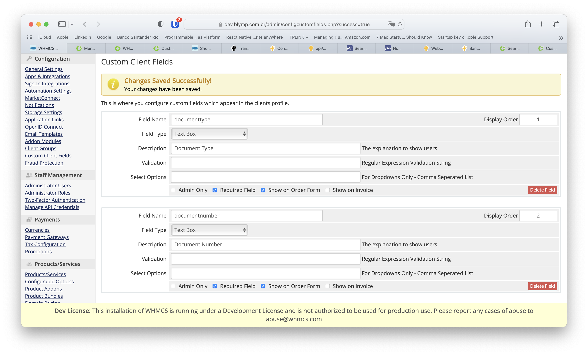
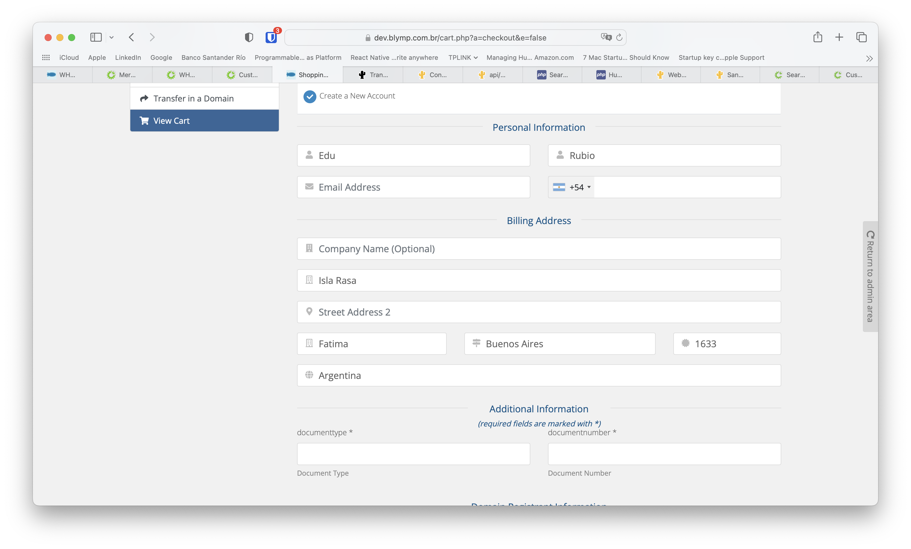

#  Tuna Payment Gateway Module for WHMCS #

## Summary ##

Payment Gateway modules allow you to integrate Tuna payment gateway with the WHMCS
platform.

| WMHCS      | Tuna |
| ----------- | ----------- |
| clientdetails.id  | customer.id       |
| invoiceid         | detailUniqueId / partnerUniqueId       |
| "Tuna"            | tokenProvider |
| "Blymp"           | softDescriptor |
| cardnum           | cardNumber |
| invoiceid         | partnerUniqueId |
| transid           | paymentKey |
| gatewayid         | token / cardInfo.token |

Configure Custom Fields
Two custom fields must be configured: documenttype and documentnumber

https://docs.whmcs.com/Custom_Fields




## Webhooks

Configure Tuna to send payment notifications to the callback that matches the
active gateway:

- `modules/gateways/callback/tunapayment.php`
- `modules/gateways/callback/tunapix.php`

Callbacks accept JSON and form-encoded payloads. Before an invoice is credited,
the module checks the payment through Tuna's `Payment/Status` API, verifies the
invoice balance, and uses Tuna's `paymentKey` as the unique WHMCS transaction
identifier.

## Tuna API flow

The implementation follows Tuna's official API documentation:

1. Credit card payments create a customer session with `Token/NewSession`.
2. New cards are tokenized with `Token/Generate`; stored cards supplied with a
   fresh CVV are validated with `Token/Bind`.
3. Card payments are submitted through `Payment/Init` with method type `1`.
   Automated WHMCS renewals are marked with `isMerchantInitiated`.
4. Pix uses the direct `Payment/Init` flow with method type `D` and renders the
   returned `pixInfo`.
   Card and Pix initialization use a stable `Idempotency-Key` per invoice and
   amount so repeated submissions return the original Tuna result.
5. Tuna webhooks are accepted only as payment confirmation after a
   server-to-server `Payment/Status` check.
6. WHMCS refunds call Tuna's `Payment/Cancel` with `cardsDetail` and the
   original `paymentKey`.

References:

- [Payment integration](https://dev.tuna.uy/api/payment-integration/)
- [Payment API](https://dev.tuna.uy/api/payment/)
- [Tuna codes and statuses](https://dev.tuna.uy/api/tuna-codes/)
- [Webhook notifications](https://dev.tuna.uy/api/webhooks-notifications/)
- [Sandbox environment](https://dev.tuna.uy/api/sandbox-environment/)
- [Idempotent requests](https://dev.tuna.uy/api/idempotent-requests/)

## Checks

Run the local regression checks with:

```bash
php tests/run.php
```


